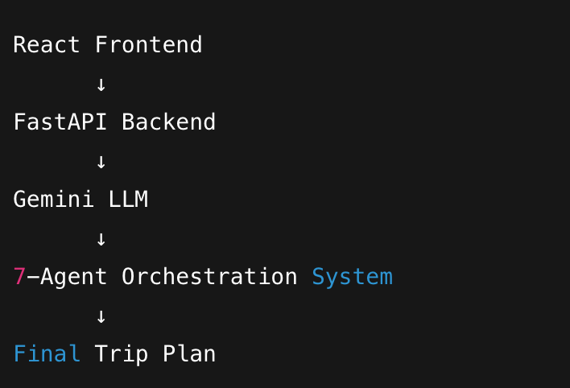

# AI Travel Planner — Personalized Trip Recommendation Engine

🚀 Pitch (Why + What + Vision)

- Travel planning is overwhelming — too many destinations, too much scattered information, and no single system that truly understands a traveler’s mood, constraints, and preferences.
AI Travel Planner solves this by acting like a personal travel intelligence engine.

- Your app takes a few simple inputs — destination, dates, budget, travelers, and interests — and then a 7-agent AI system collaborates behind the scenes to generate a deeply personalized, end-to-end trip plan.

- This is not a chatbot.
- It’s a coordinated team of specialists, each responsible for a different part of the journey. They negotiate with each other, cross-validate recommendations, and refine the final output so the user gets a trip plan that feels handcrafted by a real expert — but delivered instantly.

- The result?
- A travel plan that is organized, optimized, deeply personal, and feels like an actual travel concierge created it.

---

## 🧭 Problem Statement

# Core Concept & Value (Innovation + Relevance + Agent Use)
- Core Concept

- You’ve built a multi-agent travel orchestration engine powered by the Gemini model and FastAPI backend, with a React UI. Each agent specializes in one domain of travel planning, and the final plan emerges through an intelligent coordination loop.

# Key Value

- Human-like Travel Planning: Instead of one general AI, you simulate a team — exactly like a travel agency.
- Structured Expertise: Each agent brings domain-specific intelligence.

- Multi-step Reasoning: Complex tasks (like balancing budget, preferences, distances, daily flow) become manageable.

- Clear, central use of AI agents: Your solution requires cooperation, not just “one big prompt”.

- This makes your project clearly innovative and highly aligned with the track.
---

## 🤖 One-Line Summary for the Judge

- “A multi-agent AI travel intelligence system that transforms simple inputs into a fully personalized, expert-level travel plan — combining Gemini-powered specialist agents for transport, stays, attractions, food, itinerary design, and local insights.”

---

## 🧩 Multi-Agent Architecture

### Agent 1 — Trip Planner (Central Coordinator)

- Frames the trip, interprets user inputs, assigns responsibilities, merges all agent outputs, ensures consistency.

### Agent 2 — Transportation Agent

- Finds flight/train/bus/car options and picks choices based on dates, comfort, cost and location.

### Agent 3 — Stay/Accommodation Agent

- Suggests hotels/airbnb based on budget, proximity, safety, reviews, and convenience.

### Agent 4 — Attractions Agent

- Curates sightseeing, popular spots, hidden gems aligned with user interests.

### Agent 5 — Food & Restaurant Agent

- Curates breakfast/lunch/dinner spots based on cuisine, budget, walkability.

### Agent 6 — Itinerary Agent

- Builds a time-balanced, optimized, daily plan using outputs from Agents 2–5.

### Agent 7 — Local Insights Agent

- Adds seasonal tips, safety notes, cultural insights, best time to visit, weather considerations.

---

## ⚙️ Technical Concepts

- **Multi-Agent System:** A coordinated team of 7 specialized AI agents — transportation, accommodation, attractions, food, itinerary, local insights, and a master coordinator — work together to create an expert-level travel plan.
- **FastAPI Backend with Gemini Integration** : FastAPI handles requests. Gemini generates specialized agent reasoning. Clean separation of concerns (frontend ↔ backend ↔ agents)
**Cross-Agent Collaboration:** Agents validate and refine each other’s suggestions to eliminate duplicates, mismatches, or impractical schedules.
---
## React Frontend

- Trip input form
- Loading state (“Agents coordinating…”)
- Detailed itinerary output

## FastAPI Backend

- Orchestrates agent communication
- Calls Gemini
- Sends processed final itinerary to frontend



## 🛠️ Installation & Setup

### Prerequisites
- Python 3.10+  
- Google API key (for location search & places)  
- Weather API key  
- Gemini API key (optional, for AI reasoning)

# Set API keys
export GOOGLE_API_KEY="YOUR_KEY"
export WEATHER_API_KEY="YOUR_KEY"
export GEMINI_API_KEY="YOUR_KEY"

## 🛠️ Installation & Setup

# Backend Setup

1. Create virtual environment:
   ```
   python3 -m venv venv
   ```

2. Activate virtual environment:
   - Windows: `venv\Scripts\activate`
   - Mac/Linux: `source venv/bin/activate`

3. Install dependencies:
   ```
   pip install -r requirements.txt
   ```

4. Update .env file with your Gemini API key

5. Run server:
   ```
   uvicorn main:app --reload --port 8000
   ```

6. Visit http://localhost:8000/docs for API documentation

# Frontend Setup

1. Install dependancies
```
npm install
```
2. Run the frontend server

```
npm run dev

```

## Screenshots

### App Interface


### Agent Flow Diagram


## Future Improvements

- Flight API Integration
- Hotel API Integration
- Google Maps Distance Optimization
- Weather + Seasonal intelligence
- Export to PDF
- Save itineraries for later